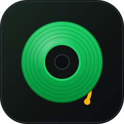
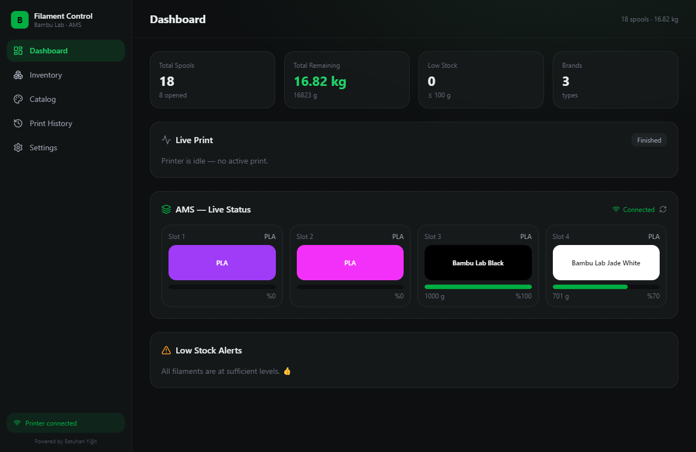
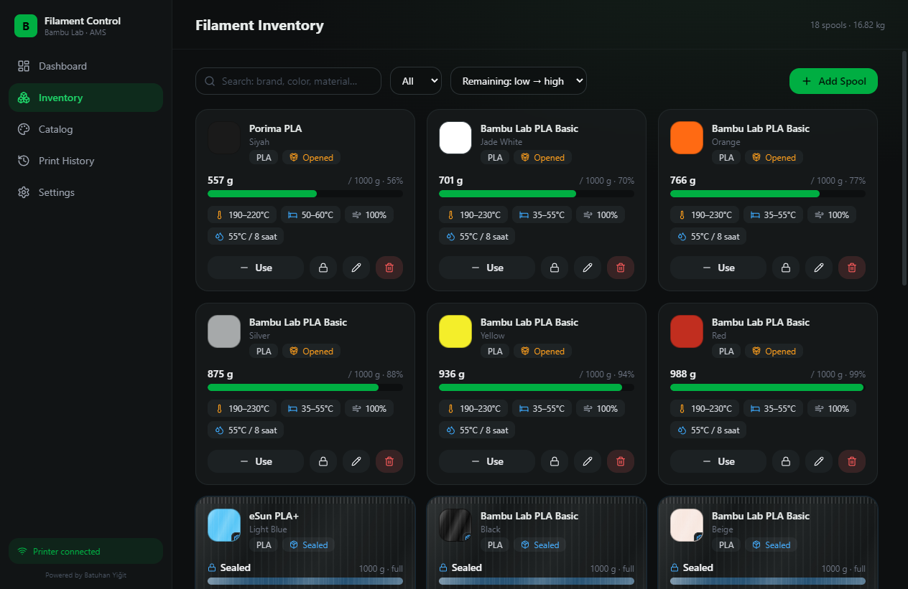
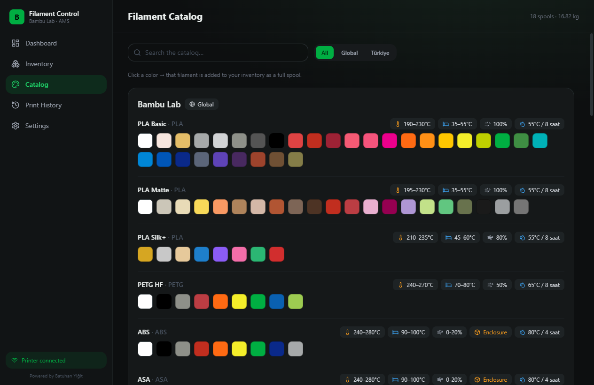
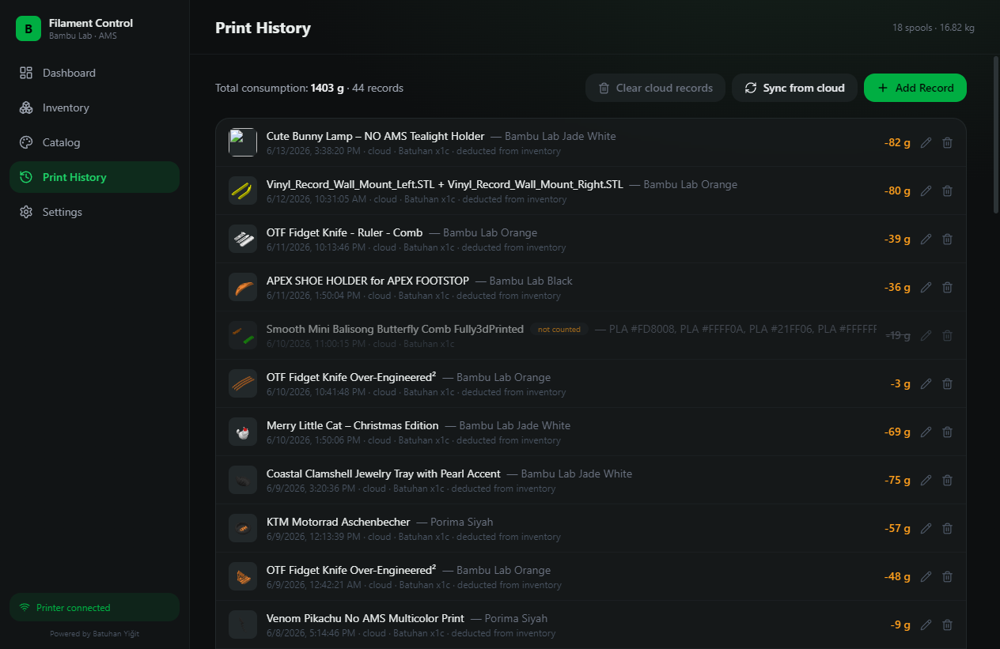
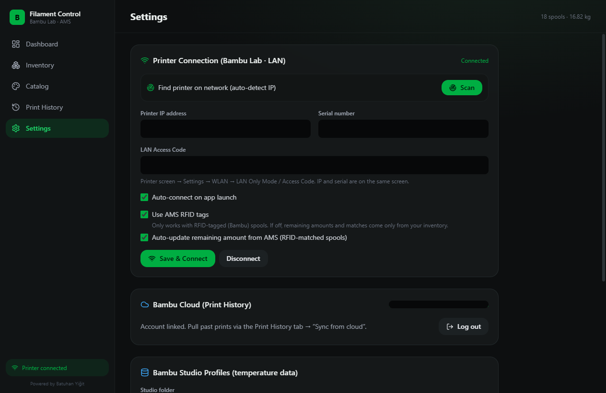

<div align="center">



# Bambu Filament Control

**Filament inventory & usage tracker for Bambu Lab 3D printers + AMS.**

[](https://github.com/BatuhanYigit/bambulab-filament-control/actions/workflows/ci.yml)
[](https://github.com/BatuhanYigit/bambulab-filament-control/releases)
[](LICENSE)


Track how much filament you have left, which spools are opened, and how much each
print consumed — with live AMS data, a rich color catalog, and Bambu Cloud history.

[**⬇ Download the latest release**](https://github.com/BatuhanYigit/bambulab-filament-control/releases/latest) · [Türkçe](#türkçe)

</div>

> **Not affiliated with Bambu Lab.** This is an independent, open-source community tool.

---

## Screenshots

### Dashboard

At-a-glance stats (total spools, remaining kg, low stock), a **Live Print** panel that shows
state, progress, layer, temperatures and the active filament while printing, and **live AMS**
slots whose percentages are synced to your inventory.

### Inventory

Every spool with remaining grams + a percentage bar and recommended temperatures. Search,
filter by type and sort (default: remaining low → high). Unopened spools appear **vacuum-sealed**;
opened ones show the bar and a "Use" button. Lock icon re-seals; pencil edits; trash deletes.

### Catalog

Bambu Lab, eSun, Polymaker, SUNLU (Global) and Porima (Türkiye) with real color hex codes and
recommended nozzle/bed temperatures. Hover a color to see its name; click it to add that
filament to your inventory.

### Print History

Manual records plus **Bambu Cloud import** (grams, filament, cover image) with a review step.
Multi-color prints deduct from each spool separately; records stay editable and cancelled prints
can be excluded.

### Settings

Connect the printer over LAN (auto-detect IP with **Scan**), Bambu Cloud login, the **RFID**
toggle, Bambu Studio profile reader, language and the low-stock threshold.
_(IP, serial, access code and email are redacted in this screenshot.)_

## Features

- **Inventory** — every spool shows remaining grams + a percentage bar (green → amber → red).
  Color swatch, brand, material and recommended temperatures at a glance.
- **Sealed vs opened spools** — unopened spools look vacuum-sealed; click to open (with
  confirmation) or re-seal. Any spool you deduct from is marked opened automatically.
- **Live AMS** — connects to the printer over your LAN (MQTT) and reads slot filament type,
  color and RFID remaining percentage. RFID-matched spools sync their remaining grams.
- **Network discovery** — finds the printer on your network (SSDP + port scan) and fills
  in the IP and serial for you.
- **Filament catalog** — Bambu Lab, eSun, Polymaker, SUNLU (Global) and Porima (Türkiye)
  with real color hex codes and recommended nozzle/bed temperatures. Click a color to add
  it to your inventory.
- **Bambu Studio profiles** — reads `%APPDATA%/BambuStudio` filament profiles for temperatures.
- **Bambu Cloud history** — imports past prints (grams, filament, cover image) with a review
  step. Multi-color prints deduct each filament from its own spool. Records stay editable;
  cancelled prints can be excluded.
- **Bilingual** — Turkish / English, switchable in Settings.

## Download & install (Windows)

1. Go to the [latest release](https://github.com/BatuhanYigit/bambulab-filament-control/releases/latest).
2. Download **`Bambu-Filament-Control-Setup-x.y.z.exe`** (installer) or the **`-portable.exe`** (no install).
3. Run it. Windows SmartScreen may warn about an unsigned app — choose _More info → Run anyway_.

## Connect to your printer

1. On the printer: **Settings → WLAN → LAN Only Mode**, note the **Access Code**.
2. The same screen shows the printer **IP** and **Serial**.
3. In the app: **Settings → Scan** (auto-detect) or enter the values manually, then **Save & Connect**.
   The PC and printer must be on the same network.

## Build from source

Requires [Node.js](https://nodejs.org/) 20+.

```bash
npm install        # first time
npm run dev        # development (hot reload)
npm run build      # production build
npm run package    # build a Windows installer into dist/
npm run icons      # regenerate icons from build/icon.svg
```

## Releasing

Releases are automated. Bump the version in `package.json`, then push a matching tag:

```bash
git tag v1.0.0
git push origin v1.0.0
```

The [release workflow](.github/workflows/release.yml) builds the Windows installer +
portable exe and attaches them to a GitHub Release.

## What it is / isn't

- ✅ A local desktop tracker for **your** filament stock and usage.
- ✅ Reads live AMS data and your Bambu Cloud print history.
- ❌ Not a slicer and not a printer-control app — it doesn't start/stop prints.
- ❌ Not affiliated with Bambu Lab. Your Bambu password is **never stored**; only a session token is kept locally.

## Tech

Electron · Vite · React · TypeScript · Tailwind CSS · `mqtt`. Data is stored locally in
`%APPDATA%/bambulab-filament-control/filament-data.json`.

## License

[MIT](LICENSE) © Batuhan Yiğit

---

<a name="türkçe"></a>

## Türkçe

**Bambu Lab 3D yazıcılar + AMS için filament envanteri ve kullanım takip uygulaması.**

Elindeki filamentlerin ne kadar kaldığını, hangi makaraların açık olduğunu ve her baskının
ne kadar harcadığını takip et — canlı AMS verisi, zengin renk kataloğu ve Bambu Cloud geçmişiyle.

[**⬇ Son sürümü indir**](https://github.com/BatuhanYigit/bambulab-filament-control/releases/latest)

### Özellikler

- **Envanter** — her makarada kalan gram + yüzde barı (yeşil → turuncu → kırmızı), renk
  örneği, marka, malzeme ve önerilen sıcaklıklar.
- **Mühürlü / açık makaralar** — açılmamış makaralar vakumlu poşet gibi görünür; tıklayıp
  onaylayarak açarsın veya tekrar mühürlersin. Gram düşülen makara otomatik "açık" olur.
- **Canlı AMS** — yazıcıya yerel ağdan (MQTT) bağlanır; yuva tipi, rengi ve RFID kalan
  yüzdesini okur, eşleşen makaraların gramını günceller.
- **Ağda yazıcı bulma** — SSDP + port taramasıyla yazıcıyı bulup IP/seri no'yu doldurur.
- **Filament kataloğu** — Bambu Lab, eSun, Polymaker, SUNLU (Global) ve Porima (Türkiye)
  gerçek renk kodları ve önerilen sıcaklıklarla. Renge tıkla → envantere eklenir.
- **Bambu Studio profilleri** — sıcaklık verisini Studio profillerinden okur.
- **Bambu Cloud geçmişi** — geçmiş baskıları (gram, filament, kapak görseli) inceleme
  adımıyla içe aktarır. Çok renkli baskılarda her filament kendi makarasından düşülür.
- **İki dilli** — Türkçe / İngilizce (Ayarlar'dan).

### Kurulum (Windows)

1. [Son sürüm](https://github.com/BatuhanYigit/bambulab-filament-control/releases/latest) sayfasına git.
2. **`...Setup-x.y.z.exe`** (kurulumlu) veya **`-portable.exe`** (kurulumsuz) indir.
3. Çalıştır. Windows SmartScreen uyarısında _Ek bilgi → Yine de çalıştır_ de.

### Yazıcıya bağlanma

1. Yazıcı: **Ayarlar → WLAN → LAN Only Mode**, **Access Code**'u not al.
2. Aynı ekranda **IP** ve **Seri No** var.
3. Uygulama: **Ayarlar → Tara** veya elle gir → **Kaydet & Bağlan**. Aynı ağda olun.

### Ne işe yarar / yaramaz

- ✅ Filament stok ve kullanımını takip eden yerel masaüstü uygulaması.
- ✅ Canlı AMS verisi ve Bambu Cloud baskı geçmişini okur.
- ❌ Dilimleyici veya yazıcı kumandası değildir — baskı başlatmaz/durdurmaz.
- ❌ Bambu Lab ile bağlantılı değildir. Bambu şifren **saklanmaz**; sadece oturum anahtarı tutulur.

---

<div align="center"><sub>Powered by <b>Batuhan Yiğit</b></sub></div>
